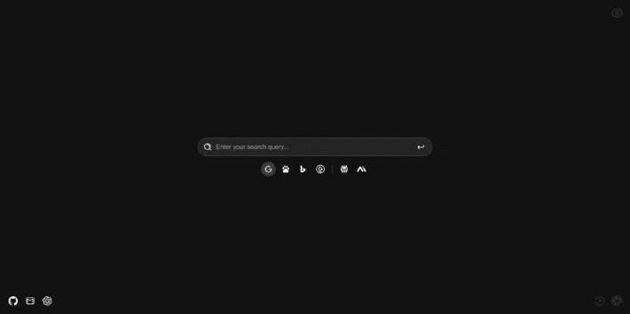

# SimpleSearchNewTab Chrome Extension

A sleek and minimalist Chrome extension that transforms your new tab page into an elegant search interface.

## Key Features

- Multi-engine search capability:
  - [Google](https://www.google.com)
  - [Baidu](https://www.baidu.com)
  - [Bing](https://www.bing.com)
  - [DuckDuckGo](https://duckduckgo.com)
  - [Perplexity.ai](https://www.perplexity.ai)
  - [Metaso](https://metaso.cn)
- Double-click functionality to open search engine homepages
- Quick access shortcuts to popular services:
  - [GitHub](https://github.com)
  - [Gmail](https://mail.google.com)
  - [ChatGPT](https://chatgpt.com)
- Customizable color themes to suit your preferences

## Installation

1. Download the ZIP file of this repository or clone it to your local machine.
2. Open Google Chrome browser and navigate to the extensions page (chrome://extensions/).
3. Enable "Developer mode" in the top right corner.
4. Click on the "Load unpacked" button in the top left corner.
5. Select the folder containing the extension files.

The SimpleSearchNewTab extension should now be installed and activated. Open a new tab and enjoy the new search experience!

## License

This project is open-source and available under the [MIT License](https://opensource.org/licenses/MIT).
